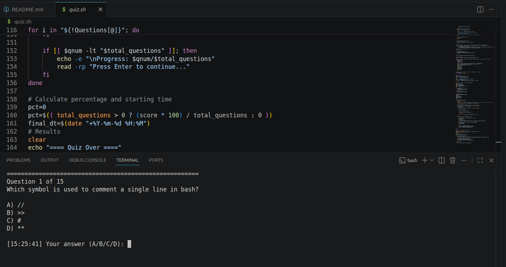
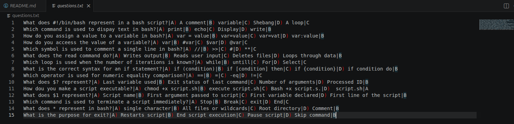
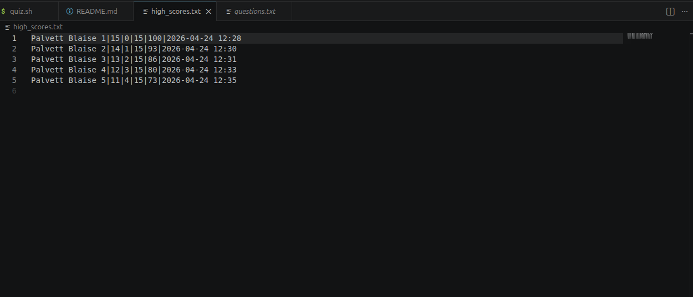
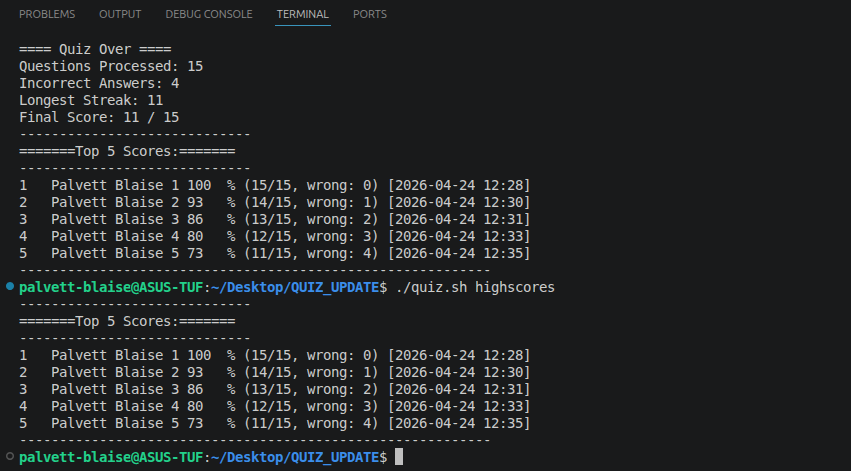

# 🏷 Terminal Quiz Game

A game that handles data parsing, randomisaton and effective storage to a highscore file.

## 📌 Problem Statement

This project allows for easy content management especiaally with the addition or modification of questions on questions,txt without using any code.It implements a local database for the output called high_scores.txt, which tracks and stores information like top 5 scores in the ranking.
It handles intergers or messy human input and accepts both lower and uppercase.
Frequent randomisation prevents memorisation of previous answers.
Perfomance tracking goes beyond just the score. Gives percentage, correct answers, wrong answers, total, time and date.
It has 2 modes; normal and practice mode. the practice mode allows users to play without pressure because their performance will not be recorded.

## 🖥 Features

Dynamic question loading.
Randomisation of questions.
Play modes, practice and normal mode.
Input validation.
Streak tracking.
Leaderboard system.

## 🛠️ Prerequisites

A Unix-like environment (Linux, macOS, WSL).
shuf utility (standard in GNU Coreutils).
A questions.txt file in the same directory.

## 📷 Screenshots






## ⚙ Installation & Setup

Clone the repository:

```bash
git clone <https://github.com/Palvett/Terminal_quiz_game.git>
cd Terminal_quiz_game

** To obtain permissions to run the script**
chmod +x quiz.sh

## How to run the code

./quiz.sh=to enter username, then continue to normal mode.
./quiz.sh practice=to launch practice mode.
./quiz.sh highscores=to see the top five scores.

🧠 Challenges Faced
The challenges were so many. I don't even know where to start from. The first was making the code to be able to read the questions.txt and others.

📚 What I Learned
I have learned how to use and substitute variables, various loops, sort information, shufle questions, pipe processed information and append it to other files.


Future Improvements
Intend to add a sleep time instead of pressing enter button to move to the next question so that the questions should display continuesly after 10 seconds.

👨🏽‍💻 Author
Fonba Palvett Blaise
Junior Fullstack Developer
📩 Email: palvettblaise406@gmail.com
🌍 Based in Cameroon | Open to remote opportunities
